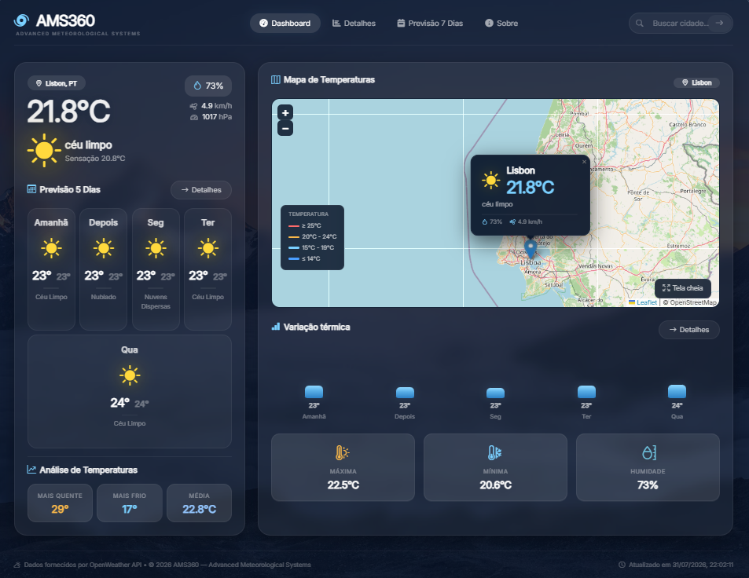
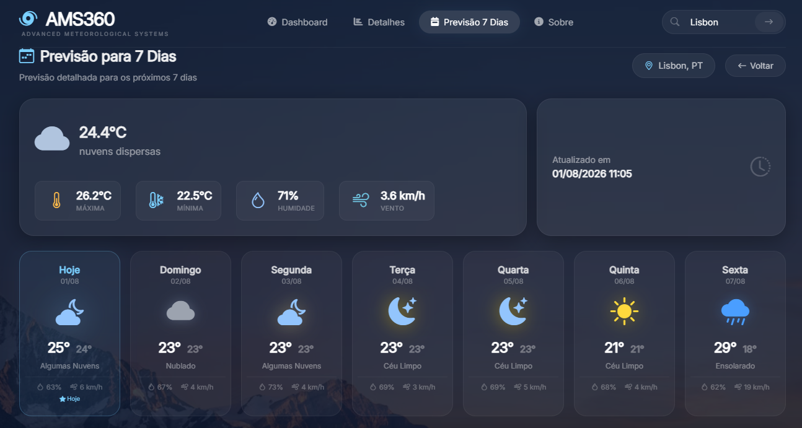
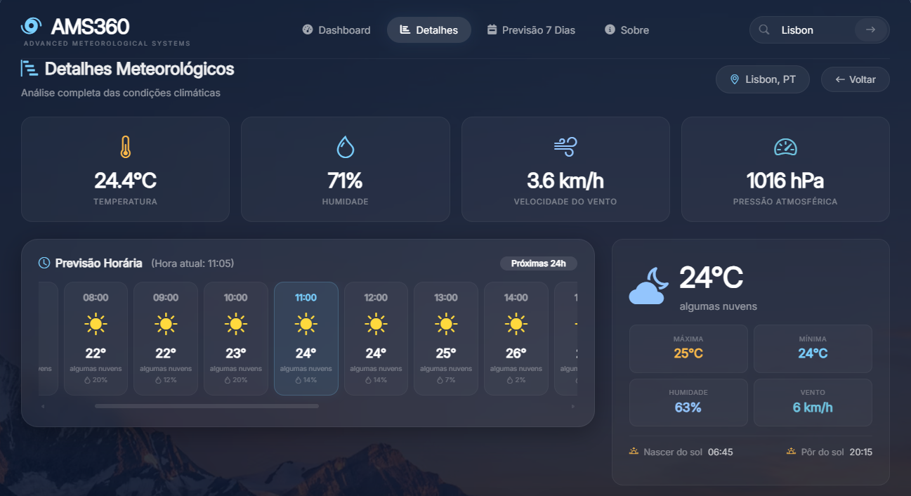
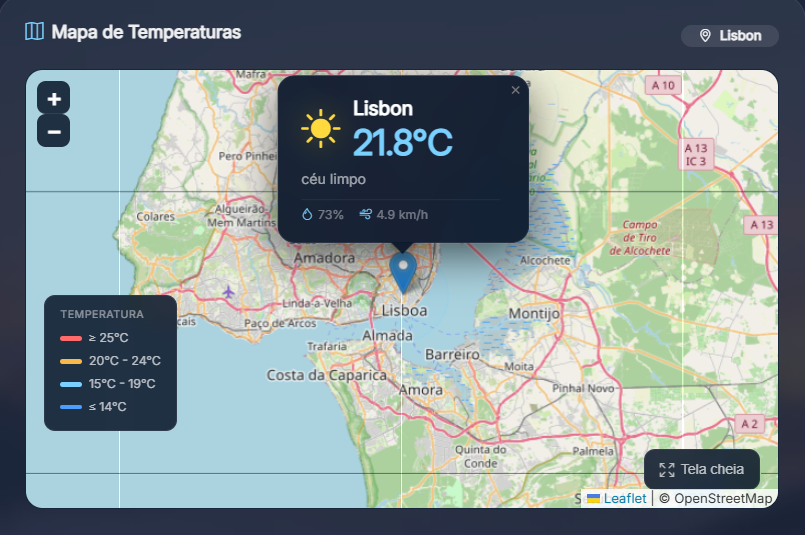

# 🌤️ AMS360 - Sistema de Monitoramento Climático

[](https://dotnet.microsoft.com/)
[](https://dotnet.microsoft.com/)
[](https://openweathermap.org/)
[](LICENSE)
[](http://localhost:5000/health)
[](.github/workflows/deploy.yml)

## 📋 Sobre o Projeto

**AMS360** é um sistema de monitoramento climático desenvolvido em **ASP.NET Core 10.0** que consome dados da API do OpenWeather para exibir informações meteorológicas em tempo real.

### 🎯 Funcionalidades

- 🌡️ **Clima atual** em tempo real
- 📅 **Previsão para 7 dias**
- 🔍 **Busca por cidade** com autocomplete
- 🗺️ **Mapa interativo** com Leaflet
- 📊 **Gráficos** com Chart.js
- 📱 **Design responsivo** e moderno (Glassmorphism)
- 🔒 **Rate Limiting** para proteção
- ❤️ **Health Checks** para monitoramento
- 🐳 **Docker** para containerização
- 🔄 **CI/CD** com GitHub Actions


## 📸 Screenshots
### Dashboard Principal


### Previsão 7 Dias


### Detalhes do Dia


### Mapa Interativo


## 🎬 Demonstração

### Vídeo de Demonstração

[Assistir vídeo de demonstração](wwwroot/videos/demo.mp4)


## 🚀 Tecnologias Utilizadas

### Backend

| Tecnologia | Versão | Descrição |
|------------|--------|-----------|
| .NET | 10.0 | Framework principal |
| ASP.NET Core | 10.0 | Framework web |
| C# | 12 | Linguagem de programação |
| OpenWeather API | - | Dados meteorológicos |
| Rate Limiting | - | Proteção contra abuso |
| Health Checks | - | Monitoramento do sistema |

### Frontend

| Tecnologia | Descrição |
|------------|-----------|
| Razor Views | Renderização server-side |
| HTML5 | Estrutura das páginas |
| CSS3 | Estilização responsiva |
| JavaScript | Interatividade |
| Bootstrap 5 | Framework CSS |
| Chart.js | Gráficos interativos |
| Leaflet | Mapas interativos |
| Font Awesome | Ícones |

### DevOps

| Ferramenta | Descrição |
|------------|-----------|
| Docker | Containerização |
| GitHub Actions | CI/CD |
| Azure App Service | Hospedagem |


## 📦 Estrutura do Projeto

## 📁 Estrutura do Projeto

```text
AMS360/
│
├── Controllers/
│   └── WeatherController.cs
│       └── Controlador responsável pelas requisições relacionadas ao clima
│
├── Models/
│   ├── WeatherResponse.cs
│   │   └── Modelo da resposta recebida da API
│   ├── WeatherViewModel.cs
│   │   └── ViewModel utilizado pelas Views
│   └── ErrorViewModel.cs
│       └── Modelo utilizado para tratamento de erros
│
├── Services/
│   ├── IWeatherService.cs
│   │   └── Interface do serviço de clima
│   ├── WeatherService.cs
│   │   └── Serviço responsável pelo consumo da API OpenWeather
│   └── WeatherHealthCheck.cs
│       └── Health Check da aplicação e do serviço de clima
│
├── Views/
│   └── Weather/
│       ├── Index.cshtml
│       │   └── Dashboard principal
│       ├── Detalhes.cshtml
│       │   └── Detalhes da previsão do dia
│       ├── PrevisaoCompleta.cshtml
│       │   └── Previsão completa para os próximos 7 dias
│       └── Sobre.cshtml
│           └── Página com informações sobre o projeto
│
├── wwwroot/
│   ├── css/
│   │   ├── site.css
│   │   │   └── Estilos globais
│   │   ├── Detalhes.css
│   │   │   └── Estilos da página de detalhes
│   │   └── PrevisaoCompleta.css
│   │       └── Estilos da previsão completa
│   │
│   └── js/
│       ├── site.js
│       │   └── JavaScript principal
│       ├── Detalhes.js
│       │   └── JavaScript da página de detalhes
│       └── PrevisaoCompleta.js
│           └── JavaScript da previsão completa
│
├── .github/
│   └── workflows/
│       └── deploy.yml
│           └── Pipeline de CI/CD com GitHub Actions
│
├── Program.cs
│   └── Ponto de entrada e configuração da aplicação
│
├── appsettings.json
│   └── Configurações da aplicação
│
├── Dockerfile
│   └── Configuração para criação da imagem Docker
│
├── docker-compose.yml
│   └── Orquestração dos containers
│
├── README.md
│   └── Documentação do projeto
│
└── LICENSE.md
    └── Licença do projeto
```

### 🏗️ Arquitetura

O projeto **AMS360** utiliza o padrão **MVC (Model-View-Controller)**, com uma camada adicional de **Services** para separar as regras de negócio e a comunicação com a API externa.

* **Controllers** → Gerenciam as requisições e respostas da aplicação.
* **Models** → Representam os dados utilizados pela aplicação.
* **Services** → Contêm a lógica de negócio e integração com a API de clima.
* **Views** → Interface gráfica desenvolvida com Razor.
* **wwwroot** → Contém arquivos estáticos como CSS e JavaScript.
* **Docker** → Responsável pela containerização da aplicação.
* **GitHub Actions** → Automatiza o processo de build, testes e deploy.


### 🏗️ Arquitetura MVC

O projeto **AMS360** segue o padrão arquitetural **MVC (Model-View-Controller)**, utilizando uma camada de serviços para separar a lógica de negócio e a integração com a API externa.

```text
┌──────────────────────────────────────────────────────────────┐
│                     👤 CLIENTE / BROWSER                     │
│                                                              │
│              Interface Web (Razor Views)                     │
└──────────────────────────────┬───────────────────────────────┘
                               │
                               │ HTTP Request
                               ▼
┌──────────────────────────────────────────────────────────────┐
│                  🎮 WEATHER CONTROLLER                       │
│                                                              │
│  ┌──────────────┐  ┌──────────────┐  ┌───────────────────┐  │
│  │    Index()   │  │  Detalhes()  │  │ PrevisaoCompleta()│  │
│  └──────────────┘  └──────────────┘  └───────────────────┘  │
│                                                              │
│        Responsável por receber e processar requisições       │
└──────────────────────────────┬───────────────────────────────┘
                               │
                               │ Chamada do serviço
                               ▼
┌──────────────────────────────────────────────────────────────┐
│                     ⚙️ WEATHER SERVICE                       │
│                                                              │
│  ┌──────────────────────────┐  ┌──────────────────────────┐ │
│  │ GetCurrentWeatherAsync() │  │ GetWeatherForecastAsync() │ │
│  └──────────────────────────┘  └──────────────────────────┘ │
│                                                              │
│       Responsável pela lógica de negócio e integração        │
└──────────────────────────────┬───────────────────────────────┘
                               │
                               │ HTTP Request
                               ▼
┌──────────────────────────────────────────────────────────────┐
│                     🌤️ OPENWEATHER API                       │
│                                                              │
│       Fornece dados meteorológicos em tempo real             │
│       e informações de previsão do tempo                     │
└──────────────────────────────┬───────────────────────────────┘
                               │
                               │ JSON Response
                               ▼
┌──────────────────────────────────────────────────────────────┐
│                     📦 MODELS / VIEWMODELS                   │
│                                                              │
│     WeatherResponse → WeatherViewModel → Razor View          │
└──────────────────────────────────────────────────────────────┘
```

### 🔄 Fluxo da aplicação

1. O **cliente** acessa a aplicação através do navegador.
2. O **WeatherController** recebe a requisição.
3. O Controller solicita os dados ao **WeatherService**.
4. O **WeatherService** realiza a comunicação com a **OpenWeather API**.
5. A API retorna os dados meteorológicos em formato **JSON**.
6. Os dados são convertidos para os **Models/ViewModels** da aplicação.
7. O Controller envia os dados para a **Razor View**.
8. A View apresenta as informações ao usuário.

### 📌 Responsabilidade de cada camada

| Camada              | Responsabilidade                                     |
| ------------------- | ---------------------------------------------------- |
| **Controller**      | Receber requisições e controlar o fluxo da aplicação |
| **Service**         | Executar regras de negócio e consumir a API externa  |
| **Model**           | Representar os dados retornados pela API             |
| **ViewModel**       | Preparar os dados para apresentação nas Views        |
| **View**            | Exibir as informações ao usuário                     |
| **OpenWeather API** | Fornecer os dados meteorológicos                     |

Essa separação facilita a **manutenção, organização, testes e evolução** do projeto, mantendo cada componente responsável por uma função específica.


## 🔧 Como Executar

### Pré-requisitos

- [.NET 10.0 SDK](https://dotnet.microsoft.com/download)
- [Visual Studio 2022](https://visualstudio.microsoft.com/) ou [VS Code](https://code.visualstudio.com/)
- Chave da API OpenWeather (gratuita)

### Passos para execução

1. **Clonar o repositório**

```bash
git clone https://github.com/rairsonfernandes/AMS360.git
cd AMS360
```

2.Restaurar pacotes

```bash
dotnet restore
Configurar API Key
`

# Opção 1: User Secrets (Recomendado)
dotnet user-secrets init
dotnet user-secrets set "WeatherApi:ApiKey" "SUA_CHAVE_AQUI"

# Opção 2: appsettings.json
# Edite o arquivo appsettings.json e adicione sua chave
Executar o sistema

dotnet run --urls="http://localhost:5000"
Acessar no navegador


http://localhost:5000
Com Docker

# Build da imagem
docker build -t ams360 .

# Executar o container
docker run -d -p 5000:8080 --name ams360 ams360

# Acessar
http://localhost:5000

🌐 API Endpoints

Endpoints Disponíveis
Endpoint	Método	Descrição
/Weather/Index	GET	Dashboard principal
/Weather/Index?city=Nome	GET	Clima de uma cidade específica
/Weather/PrevisaoCompleta	GET	Previsão para 7 dias
/Weather/Detalhes	GET	Detalhes do dia
/Weather/GetWeatherData	GET	API JSON com dados do clima
/Weather/Sobre	GET	Página sobre
/health	GET	Health Check
Exemplo de Resposta da API


{
  "success": true,
  "city": "Lisbon",
  "country": "PT",
  "temperature": 22.4,
  "temperatureMin": 21.2,
  "temperatureMax": 22.8,
  "feelsLike": 21.4,
  "humidity": 72,
  "windSpeed": 3.6,
  "windDirection": 307,
  "pressure": 1017,
  "description": "céu limpo",
  "icon": "01n",
  "lastUpdate": "2026-07-31 21:18:24",
  "forecast": [
    {
      "date": "2026-07-31",
      "dayName": "sexta",
      "temperature": 22.4,
      "temperatureMin": 21.8,
      "temperatureMax": 22.4,
      "description": "céu limpo",
      "icon": "01n",
      "humidity": 72,
      "windSpeed": 3.8,
      "pressure": 1017
    }
  ]
}

⚙️ Configuração

appsettings.json
{
  "Logging": {
    "LogLevel": {
      "Default": "Information",
      "Microsoft.AspNetCore": "Warning"
    }
  },
  "WeatherApi": {
    "BaseUrl": "https://api.openweathermap.org/data/2.5",
    "ApiKey": "SUA_API_KEY_AQUI",
    "CacheDurationMinutes": 5
  },
  "AllowedHosts": "*"
}

Variáveis de Ambiente
Variável	Descrição
ASPNETCORE_ENVIRONMENT	Ambiente (Development/Production)
WeatherApi__ApiKey	Chave da API OpenWeather

🌍 Deploy

Azure App Service

bash
# Fazer login no Azure
az login

# Criar App Service
az webapp up --name ams360 --runtime "DOTNET:10" --sku F1
Railway
Acesse: https://railway.app

Conecte com GitHub

Selecione o repositório AMS360

Deploy automático!

Heroku

# Criar Procfile
echo "web: dotnet AMS360.dll" > Procfile

# Deploy
git push heroku main

🛠️ Melhorias Futuras

□ Testes unitários e de integração
□ Gráficos de temperatura mais detalhados
□ Mapa de radar com precipitação em tempo real
□ Alertas climáticos (notificações)
□ Histórico de clima
□ Suporte a múltiplos idiomas
□ Autenticação de usuários
□ Favoritos (salvar cidades)

🤝 Contribuições

Contribuições são bem-vindas! Consulte o arquivo CONTRIBUTING.md para mais detalhes.

Fork o projeto

Crie sua branch (git checkout -b feature/AmazingFeature)

Commit suas mudanças (git commit -m 'Add some AmazingFeature')

Push para a branch (git push origin feature/AmazingFeature)

Abra um Pull Request

📄 Licença

Este projeto está sob a licença MIT. Veja o arquivo LICENSE para mais detalhes.

👨‍💻 Autor

Rairson Fernandes

GitHub: @rairsonfernandes

LinkedIn: Rairson Fernandes

Email: rairsonfernandes@gmail.com

🙏 Agradecimentos

OpenWeather pela API gratuita

Microsoft pelo .NET e ASP.NET Core

Bootstrap pelo framework CSS

⭐ Se você gostou deste projeto, deixe uma estrela no GitHub!